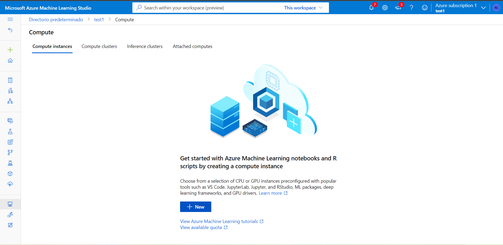
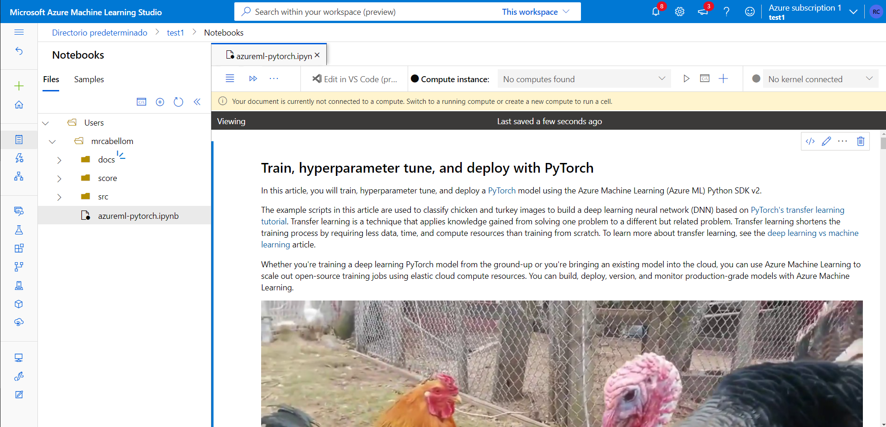

# Global AI Developers Day - Lab2: Pytorch training fine-tuning with Azure Machine Learning

En este laboratorio se relizará un entrenamiento y fine-tuning de un modelo que será capaz de clasificar pollos y pavos. Se utilizará el framework de Deep Learning de Pytorch.

Además de ver como se puede ejecutar un entrenamiento de un modelo en Azure ML, se verá como se puede lanzar un trabajo que pruebe distintos hiperparámetros de nuestro modelo y seleccione aquel entrenamiento que maximice una métrica en concreto. En este caso será la la tasa de acierto sobre el conjunto de validación.

## Requisitos previos:

- Subscripción de Azure
- Servicio de Azure Machine Learning creado
- Visual Studio Code [descarga](https://code.visualstudio.com/download)
- Miniconda [descarga](https://code.visualstudio.com/download)

Pasos adicionales

1. Crear una carpeta local llamada **AILab2** y clonar este repositorio.

```
mkdir AILab2
cd AILab2
git clone https://github.com/GlobalAISpain/developers-days-lab02.git
```

2. Si no hay un servicio de Azure Machine Learning, crear uno dentro de un grupo de recursos. Acceder a Azure Machine Learning Studio.

3. En el apartado de "compute", crear una instancia de proceso para ejecutar el notebook en el entorno de Azure Machine Learning. Seguid los pasos del Wizard y seleccionad una máquina de tipo STANDARD_DS11_V2.



4. Subir el notebook azureml-pytorch.ipynb, la imagen de test y las carpetas score, src y docs al workspace de Azure Notebooks.




**NOTA**: En caso de no tener suficiente cuota para crear máquinas virtuales se utilizará el entorno local con Miniconda y VSCODE.

- Una vez instalado miniconda, abrir Anaconda Prompt y situarse en el directorio **AILAB2**. Instalar las dependencias de python

```
conda env create --file environment.yml
```
- Activar el entorno

```
conda activate
```
- Abrir el directorio en Visual Studio Code.


## Conexión al Workspace de AzureML y lanzamiento del entrenamiento

- El notebook **azureml-pytorch.ipynb** contiene toda la información necesaria para lanzar un clasificador de aves (pollos y pavos). A lo largo de este sesión iremos completando el mismo hasta tener nuestro modelo entrenado y desplegado.

- Completar la función de preprocesamiento de datos del fichero de entrenamiento pytorch_train.py

- Completar el script de inferencia score.py dentro de la carpeta score. Este fichero será el responsable de realizar el proceso de inferencia de nuestro modelo una vez que se encuentre desplegado.